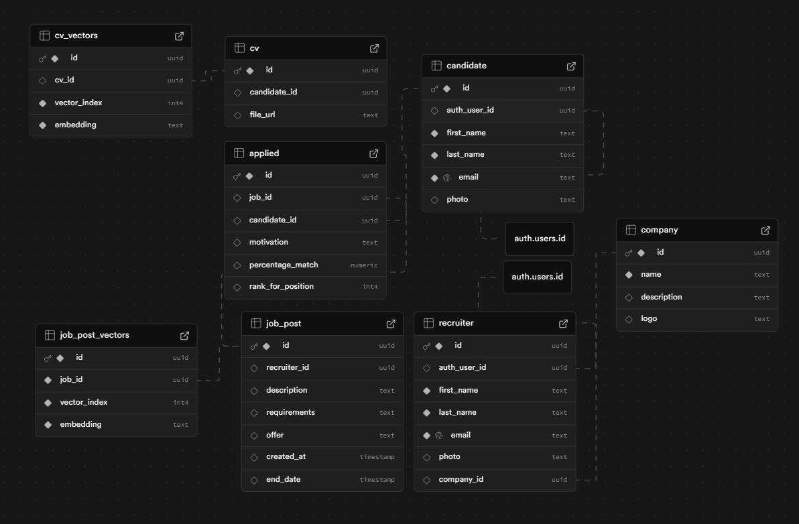

# JobsBG Automation

A job matching platform with CV processing and vector similarity search.

## Setup

1. Install dependencies:
   ```bash
   npm install
   ```

2. Run the applications:
   ```bash
   # Backend (port 3000)
   cd apps/backend
   npm run start:dev

   # Frontend (port 3001)
   cd apps/web
   npm run dev
   ```

## Routes

- **Frontend**: `http://localhost:3001/`
  - `/` - Candidate upload and job matching page

- **Backend**: `http://localhost:3000/`
  - `/recruiters` - Recruiter endpoints

## Database Structure


